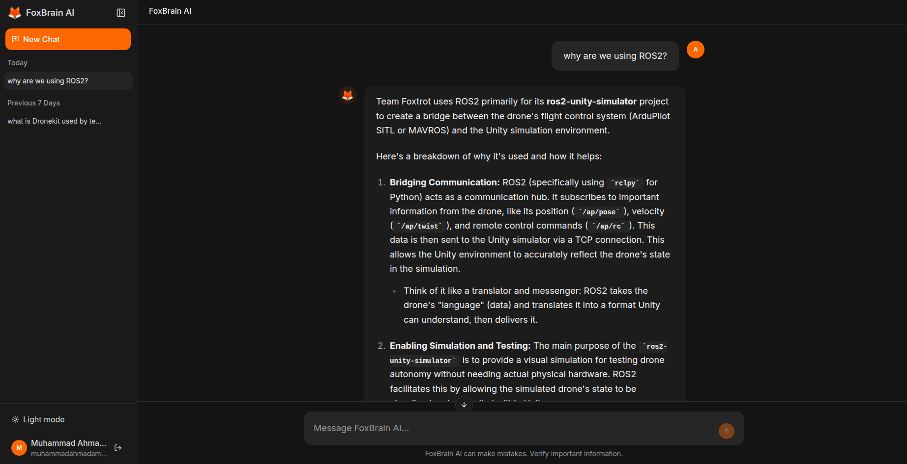

<h1 align="center">🦊 FoxBrain AI</h1>
<h3 align="center"><em>RAG-Powered AI Agent & Knowledge Assistant for Team Foxtrot GIKI</em></h3>

<p align="center">
  
  
  
  
  
  
</p>

---

## 📖 Table of Contents

- [The Problem](#-the-problem)
- [The Solution](#-the-solution)
- [Tech Stack](#-tech-stack)
- [Architecture Overview](#-architecture-overview)
- [Project Structure](#-project-structure)
- [RAG Agent Workflow](#-rag-agent-workflow)
- [Data Ingestion Pipeline](#-data-ingestion-pipeline)
  - [Parent Workflow](#parent-workflow--foxtrot_dataflow_parent)
  - [Child Workflow](#child-workflow--foxtrot_dataflow_child)
  - [GrandChild Workflow](#grandchild-workflow--foxtrot_dataflow_grandchild)
  - [Live GitHub Commit Workflow](#live-github-commit-workflow--live_github_commit_pinecone_update)
  - [Google Drive Workflow](#google-drive-workflow--dataflow_googledrive)
- [Deploying to Vercel](#-deploying-to-vercel-password-reset)
- [Contributing](#-contributing)
- [License](#-license)

---

## 🎯 The Problem

**Team Foxtrot** is a multidisciplinary engineering team at **GIKI (Ghulam Ishaq Khan Institute)** with subteams spanning Software Development and Embedded Systems (SDES). The team maintains a growing number of repositories containing Python scripts, Lua autopilot code, Jupyter notebooks, drone waypoint files, configuration files, and extensive documentation.

Every year, **freshers (new recruits)** face a recurring set of challenges:

| Pain Point | Description |
|---|---|
| **Information Overload** | Dozens of repositories with thousands of files — no single entry point to understand what's going on. |
| **Lack of Technical Depth** | Freshers often don't have the background to understand the projects at first glance, even after senior members explain them. |
| **Fear of Asking Again** | Many freshers feel **shy or hesitant** to ask seniors to re-explain concepts they didn't fully grasp the first time. |
| **Knowledge Silos** | Tribal knowledge lives in the heads of senior members and gets lost when they graduate. |
| **Onboarding Bottleneck** | Seniors spend significant time repeatedly answering the same foundational questions every recruitment cycle. |

This creates a **knowledge gap** that slows down onboarding, reduces productivity, and makes it harder for new members to contribute meaningfully to ongoing projects.

---

## 💡 The Solution

**FoxBrain** is an AI-powered **Retrieval-Augmented Generation (RAG) chatbot** that serves as an always-available, intelligent knowledge assistant for Team Foxtrot.

Instead of asking a senior (and feeling awkward about it), freshers can simply **ask FoxBrain**:

> *"How does the PID controller work in our drone autopilot?"*
> *"What does the `mission_planner.py` script do?"*
> *"Explain the communication protocol between the ground station and the drone."*

FoxBrain will:
1. **Search** through all of Team Foxtrot's GitHub repositories
2. **Retrieve** the most relevant code snippets, documentation, and notebooks
3. **Generate** a clear, context-aware answer using Google Gemini LLM
4. **Remember** conversation context for natural follow-up questions

### Key Benefits

- 🕐 **Available 24/7** — No need to wait for a senior to be free
- 🤫 **No Judgment** — Ask the same question 100 times without feeling shy
- 📚 **Always Up-to-Date** — Automatically ingests the latest code from GitHub
- 🧠 **Context-Aware** — Understands code, docs, and notebooks in depth
- 💬 **Conversational** — Maintains chat history for natural dialogue

<p align="center">
  
  <br/>
  <em>FoxBrain AI — Chat interface for Team Foxtrot freshers</em>
</p>

---

## 🏗 Architecture Overview

```
┌─────────────────────────────────────────────────────────────────────┐
│                        FoxBrain Architecture                        │
├─────────────────────────────────────────────────────────────────────┤
│                                                                     │
│   ┌──────────┐    ┌──────────────────────┐    ┌─────────────────┐  │
│   │  GitHub   │───▶│  n8n (Oracle Cloud)  │───▶│  Pinecone       │  │
│   │  Repos    │    │  + Caddy (SSL/TLS)   │    │  Vector DB      │  │
│   └──────────┘    └──────────┬───────────┘    └────────┬────────┘  │
│                              │                           │          │
│                              ▼                           ▼          │
│   ┌──────────────────┐    ┌──────────────────┐    ┌─────────────────┐
│   │  React Frontend  │───▶│  RAG Agent (n8n)  │◀───│  Supabase       │
│   │  (Vercel)        │    │  + Gemini LLM     │    │  DB + Auth      │
│   └──────────────────┘    └──────────────────┘    └─────────────────┘
│                                                                     │
└─────────────────────────────────────────────────────────────────────┘
```

---

## 📁 Project Structure

```
SDES_Chatbot/
│
├── 📄 README.md                              # Documentation
├── 📄 LICENSE                                 # Project license
├── Backend/
│   ├── RAGAgent.json                         # RAG Agent (chat) workflow
│   ├── Dataflow/
│   │   ├── Foxtrot_DataFlow_Parent.json      # Parent orchestrator workflow
│   │   ├── Foxtrot_DataFlow_Child.json       # Per-repo branch discovery workflow
│   │   ├── Foxtrot_DataFlow_GrandChild.json  # Per-branch file processing workflow
│   │   ├── Live_GitHub_Commit_Pinecone_Update.json  # Live webhook for auto-sync
│   │   └── Dataflow_GoogleDrive.json         # Google Drive ingestion workflow
│   └── *.png                                 # Workflow screenshots
│
└── Frontend/
    ├── src/                                  # React source code
    ├── package.json                          # Frontend dependencies
    └── [other frontend config files]         # TypeScript, Vite, Tailwind configs
```

---

## 🛠 Tech Stack

### **Backend & Automation**

| Technology | Purpose |
|---|---|
| **n8n** | Workflow automation for data ingestion pipeline and RAG agent orchestration |
| **Oracle Cloud** | Hosting platform for n8n workflows |
| **Caddy** | Reverse proxy and automatic SSL/TLS for n8n |
| **Pinecone** | Vector database for document embeddings and RAG retrieval |
| **Google Gemini** | LLM for generating answers |
| **HuggingFace Inference API** | Embedding generation for document chunks |
| **GitHub API** | Source repository access for automated knowledge ingestion |

### **Frontend**

| Technology | Purpose |
|---|---|
| **React 18** | Core frontend framework |
| **TypeScript** | Type-safe JavaScript |
| **Vite** | Build tool and development server |
| **TailwindCSS** | Utility-first CSS framework |
| **shadcn/ui** | Reusable UI components library |
| **Vercel** | Frontend hosting and deployment |

### **Database & Authentication**

| Technology | Purpose |
|---|---|
| **Supabase** | PostgreSQL database for conversations and user data |
| **Supabase Auth** | User authentication, signup, login, and password reset |

### **Infrastructure**

| Technology | Purpose |
|---|---|
| **Oracle Cloud** | n8n server hosting |
| **Caddy** | TLS termination and reverse proxy for n8n |
| **Vercel** | Frontend hosting |
| **GitHub** | Source code and version control |

---

## 🤖 RAG Agent Workflow

The **RAGAgent** workflow powers the FoxBrain AI chat interface. It receives user messages from the frontend via webhook, retrieves relevant context from Pinecone, and generates answers using Google Gemini.

**Flow:** Webhook → AI Agent (Gemini + Pinecone retrieval) → Respond to Webhook

<p align="center">
  
</p>

---

## 🔄 Data Ingestion Pipeline

The data pipeline is built using **n8n** workflows in a **Parent → Child → GrandChild architecture** to systematically crawl all repositories and **all branches** in the `Team-Foxtrot-GIKI` GitHub organization, extract relevant files, and embed them into the Pinecone vector database for retrieval by the RAG agent.

### Why Three Workflows?

The previous two-workflow architecture (Parent → Child) only fetched code from the **main branch** of each repository. This was a significant limitation because many repositories have active development branches containing important code changes, experimental features, and work-in-progress implementations that freshers need to understand.

The new three-workflow architecture solves this by introducing a **Child workflow** that discovers all branches, and a **GrandChild workflow** that processes files from each specific branch:

```
┌──────────────────────────────────────────────────────────────────────────────┐
│                         Data Ingestion Architecture                          │
├──────────────────────────────────────────────────────────────────────────────┤
│                                                                              │
│   ┌─────────────┐     ┌─────────────┐     ┌─────────────────────────────┐   │
│   │   PARENT    │────▶│    CHILD    │────▶│         GRANDCHILD          │   │
│   │ (List Repos)│     │(List Branch)│     │ (List Files → Filter → Embed)│   │
│   └─────────────┘     └─────────────┘     └─────────────────────────────┘   │
│         │                   │                          │                    │
│         │ loops             │ loops                    │ processes          │
│         │ repos             │ branches                 │ files              │
│         ▼                   ▼                          ▼                    │
│   [Repo A]             [main, dev,              [file1.py, file2.md,       │
│   [Repo B]              feature-x]               config.yaml, ...]         │
│   [Repo C]                                                                  │
│                                                                              │
└──────────────────────────────────────────────────────────────────────────────┘
```

---

### Parent Workflow — `Foxtrot_DataFlow_Parent`

The top-level orchestrator that manages the entire ingestion process across all repositories.

**Purpose:** Fetches all repositories from the GitHub organization and dispatches them to the Child workflow for branch discovery.

**Flow:**
```
Manual Trigger
      │
      ▼
Fetch All Repos (GitHub API)
      │
      ▼
Loop Over Each Repository
      │
      ▼
Call Child Workflow (pass repo name)
      │
      ▼
   (repeat for all repos)
```

**Key Features:**
- Lists all repositories in the `Team-Foxtrot-GIKI` organization
- Iterates through repositories one-by-one using a batch loop
- Passes repository name to Child workflow for branch discovery
- Waits for Child workflow to complete before processing next repo
- Retry logic enabled for reliability

**Configuration:**
| Property | Value |
|---|---|
| **Organization** | `Team-Foxtrot-GIKI` |
| **Processing Mode** | Sequential (one repo at a time) |
| **Calls Workflow** | `Foxtrot_DataFlow_Child` |
| **Error Handling** | Retry enabled |

<p align="center">
  
</p>

---

### Child Workflow — `Foxtrot_DataFlow_Child`

The branch discovery workflow that acts as the **bridge** between Parent (repos) and GrandChild (files). This workflow ensures code from **all branches** gets processed, not just the main branch.

**Purpose:** Receives a repository name from Parent, discovers all branches in that repository, and dispatches each branch to the GrandChild workflow for file processing.

**Flow:**
```
Receive Repository Name (from Parent)
              │
              ▼
Fetch All Branches (GitHub API)
              │
              ▼
Loop Over Each Branch
              │
              ▼
Format Payload (repo_name + branch_name)
              │
              ▼
Call GrandChild Workflow
              │
              ▼
       (repeat for all branches)
```

**Key Features:**
- Receives repo name via workflow trigger input
- Calls GitHub API to list all branches for the repository
- Loops through branches one-by-one
- Combines `repo_name` and `branch_name` into a single payload
- Passes combined payload to GrandChild for file-level processing
- Ensures multi-branch coverage in the vector database

**Configuration:**
| Property | Value |
|---|---|
| **Input** | Repository name from Parent |
| **Output** | Calls GrandChild for each branch |
| **Processing Mode** | Sequential (one branch at a time) |
| **Calls Workflow** | `Foxtrot_DataFlow_GrandChild` |

<p align="center">
  
</p>

---

### GrandChild Workflow — `Foxtrot_DataFlow_GrandChild`

The file processing workflow that handles the actual work of discovering files, fetching their content, and embedding them into Pinecone.

**Purpose:** Receives a repository name and branch name, recursively lists all files, filters them by type, fetches raw content, and embeds into Pinecone with full metadata.

**Flow:**
```
Receive Repo + Branch (from Child)
              │
              ▼
List Directory Contents (GitHub API with ?ref=branch)
              │
              ▼
        Route by Type
        │            │
        │ (dir)      │ (file)
        ▼            ▼
Dir Exclusion    File Type Filter
    Filter       (.py .md .lua etc.)
        │            │
        ▼            ▼
   (recurse)    Fetch Raw File Content
                     │
                     ▼
              Buffer Metadata
              (repo, branch, path, name)
                     │
                     ▼
              Embed into Pinecone
              (HuggingFace + metadata)
```

**Processing Steps:**

1. **Directory Traversal** — Recursively lists all files in the repository for the specified branch using the `?ref=branch` query parameter
2. **Routing** — Separates directories from files for different processing paths
3. **Directory Filtering** — Excludes directories like `.git`, `node_modules`, `__pycache__`, etc.
4. **File Type Filtering** — Only processes supported extensions (`.py`, `.md`, `.lua`, `.yaml`, etc.)
5. **Content Fetching** — Uses `Accept: application/vnd.github.v3.raw` header to fetch raw file content from the specific branch
6. **Metadata Buffering** — Injects `repo_name`, `branch_name`, `path`, and `name` into local JSON to prevent LangChain lineage issues
7. **Embedding & Storage** — Converts content to embeddings via HuggingFace and stores in Pinecone with full metadata

**Configuration:**
| Property | Value |
|---|---|
| **Input** | `repo_name` + `branch_name` from Child |
| **GitHub API** | Uses `?ref=branch_name` for branch-specific content |
| **Embedding Model** | HuggingFace `sentence-transformers/all-MiniLM-L6-v2` |
| **Vector Store** | Pinecone |
| **Metadata Fields** | `repo`, `branch`, `filePath`, `fileName`, `fileExtension`, `source` |

<p align="center">
  
</p>

---

### Live GitHub Commit Workflow — `Live_GitHub_Commit_Pinecone_Update`

A **real-time webhook-based workflow** that automatically keeps FoxBrain's knowledge base in sync with the latest code changes. Whenever a developer pushes code to any repository in the GitHub organization, this workflow instantly updates Pinecone — no manual re-ingestion required.

**Purpose:** Listens for GitHub push events via webhook, extracts modified files, deletes outdated vectors, and embeds the fresh code into Pinecone automatically.

**Flow:**
```
GitHub Push Event (Webhook)
              │
              ▼
Extract Push Metadata (JS)
  • repo_name, branch_name
  • path, filename
  • for each added/modified file
              │
              ▼
Delete Old Vectors (Pinecone)
  • Filter by repo + branch + filePath
  • Prevents duplicate/conflicting chunks
              │
              ▼
Download Fresh Code (GitHub API)
  • Uses Accept: application/vnd.github.v3.raw
  • Fetches from specific branch
              │
              ▼
Insert New Vectors (Pinecone)
  • HuggingFace embeddings
  • Full metadata (repo, branch, path, etc.)
```

**Key Features:**
- **Webhook-Based** — Triggered automatically on every `git push` to the organization
- **Self-Cleaning** — Deletes outdated vectors before inserting new ones to prevent duplicate or conflicting information
- **Branch-Aware** — Tracks which branch each file came from using the `ref` field
- **Incremental Updates** — Only processes files that were actually added or modified in the commit, not the entire repository
- **Same Metadata Schema** — Uses identical metadata fields as the batch ingestion workflows for consistency

**How It Works:**

1. **Webhook Trigger** — GitHub sends a POST request to `/github-org-push` endpoint whenever code is pushed
2. **Metadata Extraction** — JavaScript parses the push payload and extracts file paths for all `added` and `modified` files in each commit
3. **Vector Cleanup** — For each file, queries Pinecone and deletes existing vectors matching `{repo, branch, filePath}` to prevent stale data
4. **Content Fetching** — Downloads the raw file content from GitHub using branch-specific URLs
5. **Re-Embedding** — Chunks the fresh code, generates embeddings via HuggingFace, and inserts into Pinecone with full metadata

**Configuration:**
| Property | Value |
|---|---|
| **Trigger Type** | Webhook (POST) |
| **Webhook Path** | `/github-org-push` |
| **GitHub Event** | `push` |
| **Processing** | Per-file (added + modified only) |
| **Vector Cleanup** | Automatic (filter by repo/branch/path) |
| **Status** | Active (always listening) |

**Why This Matters:**

Without this workflow, FoxBrain would only know about code that existed during the last manual batch ingestion. With live updates enabled:
- Freshers always get answers based on the **latest code**
- Bug fixes and new features are immediately searchable
- No need to manually re-run the Parent → Child → GrandChild pipeline after every commit

<p align="center">
  
</p>

---

### Google Drive Workflow — `Dataflow_GoogleDrive`

Ingests files from a **Google Drive folder** (Foxtrot) into Pinecone. Use this for documentation or files not stored in GitHub.

**Flow:** Manual Trigger → Search folder → Download files → Embed into Pinecone

<p align="center">
  
</p>

---

### Excluded Directories

The following directories are **automatically skipped** to avoid processing unnecessary files:

```
.git              # Git metadata
.venv / env       # Virtual environments
__pycache__       # Python cache
site-packages     # Python packages
node_modules      # NPM dependencies
dist-info         # Distribution metadata
PackageCache      # Package cache
Artifacts         # Build artifacts
Logs              # Log files
UserSettings      # User-specific settings
assets            # Asset files
Plugins           # Plugin directories
Library           # Library directories
mavlink           # Drone protocol files
.github           # GitHub configuration
```

---

### Supported File Types

The pipeline processes the following file types to build the knowledge base:

| Extension | Type | Purpose |
|---|---|---|
| `.py` | Python source code | Team Foxtrot's primary language for UAV autopilot and utilities |
| `.md` | Markdown documentation | README files, guides, and inline documentation |
| `.lua` | Lua scripts | Drone autopilot scripting language |
| `.txt` | Plain text files | Configuration and documentation files |
| `.yaml` / `.yml` | Configuration files | Workflow and system configurations |
| `.ipynb` | Jupyter Notebooks | Data analysis and research notebooks |
| `.waypoints` | Drone waypoint files | UAV mission planning files |

**Excluded Types:** Images (`.png`, `.jpg`), binaries, `.docx`, compressed files, `.json` (to reduce noise), and other unsupported formats are automatically discarded.

---

### Vector Storage Configuration

**Database:** Pinecone  
**Index Name:** `test`  
**Embedding Model:** HuggingFace Inference API (`sentence-transformers/all-MiniLM-L6-v2`)

Each embedded document includes the following metadata:

| Metadata Field | Description | Example |
|---|---|---|
| `repo` | Repository name | `autopilot` |
| `branch` | Branch name | `main`, `develop`, `feature-gps` |
| `filePath` | Full path to file | `src/controllers/pid.py` |
| `fileName` | File name only | `pid.py` |
| `fileExtension` | Extension | `py` |
| `source` | GitHub URL to file | `https://github.com/Team-Foxtrot-GIKI/autopilot/blob/develop/src/controllers/pid.py` |

This comprehensive metadata enables the RAG agent to:
- Retrieve code from specific branches when relevant
- Provide direct links to source files on GitHub
- Filter results by repository, branch, or file type
- Give freshers full context about where the code lives

---

## 📄 License

This project is licensed under the terms specified in the [LICENSE](LICENSE) file.

---

<p align="center">
  <em>Because no question is a dumb question, especially when a bot is answering it. 🦊</em>
  <br/>
  <b>Team Foxtrot GIKI — SDES Subteam</b>
</p>
